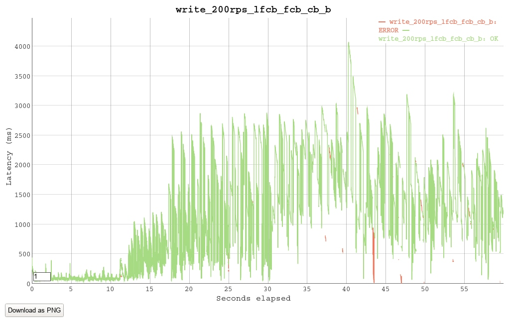

### Конфигруация стенда
AWS c5d.2xlarge инстанс (8 виртуальных ядер) 

### Конфигруация сервера
Изначально планировался тест связки **nginx - gunicorn - mysql**.  
Уже на rps>400 nginx начинал вести себя не очень хорошо забирал все ресупсы CPU,
и это не решилось увеличением количества воркеров, уменьшением таймаутов и другими настройками.
Nginx Status Page показала, что в моменты большой загрузки сильно растут счетчки Writing или Waiting
(в зависимости от настройки keepalive). Я пока не разобрался в чем проблема и продолжил тестирование звязки 
**gunicorn - mysql**, т.е. gunicorn работал в качестве фронтенда. 
На нем было запущено 4 воркера aiohttp.GunicornWebWorker
    
    
### База    
Для теста сгенерирована база 8'000'000 случайных аккаунтов:
 ```
    table users:
        user_id: INT PRIMARY KEY
        first_name: VARCHAR(63)
        last_name: VARCHAR(63)
        city: VARCHAR(63)
        birth_date: DATE
        udata: JSON

    table auth:
        login: VARCHAR(63) PRIMARY KEY
        password: VARCHAR(63)
        user_id: INT AUTO_INCREMENT UNIQUE
```
Данные хоть и рандомные, но с честным распределением жителей по городам РФ.
Фамилии обладают высокой селективностью, имена - низкой. Распределение возрастов - примерно как в инстаграме.

### Индексы
Теоретически, нужно 7 индексов, чтобы "полностью покрыть" селекты по критериям
```
first_name, last_name, city, birth_date range
```
- lfcb - (last_name, first_name, city, birth_date) 
- lfb - (last_name, first_name, birth_date)
- lcb - (last_name, city, birth_date)
- lb - (last_name, birth_date)
- fcb - (first_name, city, birth_date)
- fb - (first_name, birth_date)
- cb - (city, birth_date)
- b - (birth_date)

birth_date всегда должен быть в конце ключа, потому что это единственный критерий, который задается диапазоном.
В порядке селективности: last_name > first_name > city. Последние 2 поля обладают достаточно низкой селективностью,
возможно наличие индексов с их промежуточными перестановками некритично. Конечно, в реальной жизни
не нужно всегда показывать точную инфу для таких запросов как city + birth_date или first_name + city,
и большую часть индексов можно заменить на какие-то другие механизмы. 

Тестрование производилось инструментом [vegeta](https://github.com/tsenart/vegeta). Длительность прогонов - 60 секунд.

### Сценарий 1: Чтение 
/find_users

Поиск 10 первых записей по случайно выбранным first_name, last_name, city, диапазону birth_date.
Каждый из критериев входит в запрос с вероятностью ~0.5, т.е. каждый запрос это комбинация 1-4 случайных критериев
(но выбранных с учетом статистического распределения).
Т.к. выбор критериев случаен, не гарантируется что запрос что-то найдет.
Кроме этого, с вероятностью 0.3, в критерии подмешивается мусор, чтобы еще больше усложнить жизнь базе.


1.1. Чтение, без индексов, rps=2
```
Requests      [total, rate, throughput]  120, 2.02, 1.58
Latencies     [mean, 50, 95, 99, max]    6.414377311s, 5.112647185s, 16.839534023s, 23.039658867s, 28.146818067s
Status Codes  [code:count]               200:120  
```


mysql cpu ~420, gunicorn не потел. Уперлись в потолок 4-х физических ядер.
Уже на такой нагрузке слишком высокий latency и низкий throughput.
Без индексов все очень плохо.  

1.2. Добавим индекс lfcb, rps=2
```
Requests      [total, rate, throughput]  120, 2.02, 1.92
Latencies     [mean, 50, 95, 99, max]    479.004019ms, 34.848487ms, 2.926287423s, 3.021701043s, 3.033830818s
Status Codes  [code:count]               200:120 
```


mysql cpu 0-200. Индекс помог, но остались пики от запрсрв которые не вклюают в себя last_name.

1.3. Добавим индекс fcb, rps=2
```
Requests      [total, rate, throughput]  120, 2.02, 2.02
Latencies     [mean, 50, 95, 99, max]    176.714112ms, 33.106469ms, 1.455251725s, 1.89378022s, 2.826967188s
Status Codes  [code:count]               200:120  
```


mysql cpu 0-100

1.4. Добавим индекс cb, rps=2
```
Requests      [total, rate, throughput]  120, 2.02, 2.02
Latencies     [mean, 50, 95, 99, max]    43.761788ms, 31.187694ms, 70.761524ms, 470.269898ms, 820.261622ms
Status Codes  [code:count]               200:120  
```


cpu уже около нуля, но все еще очились какие-то тычки от запросов в которых только birth_date, 
но может быть это просто погрешность.

1.5. lfcb + fcb + cb, попробуем rps=20
```
Requests      [total, rate, throughput]  1200, 20.02, 20.00
Latencies     [mean, 50, 95, 99, max]    198.013172ms, 37.732778ms, 1.097636018s, 2.96512649s, 6.003588012s
Status Codes  [code:count]               200:1200  
```


cpu опять около нуля, но тычки стали заментее.

1.6. Добавим индекс b, rps=20
```
Requests      [total, rate, throughput]  1200, 20.02, 20.00
Latencies     [mean, 50, 95, 99, max]    37.825359ms, 34.232546ms, 52.11141ms, 110.8538ms, 459.07489ms
Status Codes  [code:count]               200:1200  
Error Set:
```


mysql cpu 2-8. Вроде тычки пропали, хотя есть какие-то подозрительные ворсинки.
Видна аномально большая задержка в начале теста, она будет появляться и дальше,
я пока не нашел объяснения.

1.7. lfcb + fcb + cb + b, rps=200
```
Requests      [total, rate, throughput]  12000, 200.02, 199.91
Latencies     [mean, 50, 95, 99, max]    37.889921ms, 33.756232ms, 57.522275ms, 99.550341ms, 483.158473ms
Status Codes  [code:count]               200:12000  
```


mysql cpu 25

1.8. lfcb + fcb + cb + b, rps=500
```
Requests      [total, rate, throughput]  30000, 500.02, 499.56
Latencies     [mean, 50, 95, 99, max]    46.545368ms, 36.639862ms, 87.410288ms, 178.991258ms, 758.579586ms
Status Codes  [code:count]               200:30000  
```


mysql cpu 55

1.9. lfcb + fcb + cb + b, rps=1000
```
Requests      [total, rate, throughput]  60000, 1000.02, 999.31
Latencies     [mean, 50, 95, 99, max]    85.473849ms, 53.016246ms, 224.62193ms, 452.424743ms, 1.224916211s
Status Codes  [code:count]               200:60000  
```


mysql cpu 130-150

1.10. lfcb + fcb + cb + b, rps=1500
```
Requests      [total, rate, throughput]  90000, 1500.02, 1497.85
Latencies     [mean, 50, 95, 99, max]    151.768045ms, 89.245926ms, 487.200271ms, 817.073334ms, 1.535499516s
Status Codes  [code:count]               200:90000  
```


mysql cpu 200-250, gunicorn 110. Приближаемся к потолку cpu. 

1.11. lfcb + fcb + cb + b, rps=2000
```
Requests      [total, rate, throughput]  45926, 1811.96, 1525.50
Latencies     [mean, 50, 95, 99, max]    2.269321509s, 1.591559988s, 8.000251822s, 8.001906743s, 8.196890288s
Status Codes  [code:count]               0:4449  200:41477  
```


mysql cpu 280-300, gunicorn 130. Уперлись в потолок cpu, пошлю таймауты.

1.12. Проверим, поможет ли добавление других индексов (lcb, lb, fb) для "полного покрытия" селекта. 

lfcb + fcb + cb + b + lcb + lb + fb, rps=1000
```
Requests      [total, rate, throughput]  30000, 1000.04, 982.76
Latencies     [mean, 50, 95, 99, max]    266.372649ms, 154.93324ms, 891.510426ms, 1.543508772s, 8.005444239s
Status Codes  [code:count]               0:5  200:29995
```


Ситация стала хуже (по сравнениею с предыдущим тестом 1000rps). Explain analyze показывает,
что в запросах last_name + birth_date с дополнительным индексом lb, 
mysql предпочитает делать index range scan по lb, видимо с учетом высокой селективности last_name.
Это медленнее чем чем Index lookup with condition по lfcb. Индексы lсb, fb в некоторых запросах 
позволяют делать Index lookup без condition на first_name и city, но это не приносит выигрыша
из-за низкой селективности этих подключей в других индексах (где работает Index lookup with condition).

### Сценарий 2: запись 
/update_user

Случайному юзеру в поля (last_name, first_name, city, birth_date) записываются случаные значения.

2.1. lfcb + fcb + cb + b, rps=100
```
Requests      [total, rate, throughput]  6000, 100.01, 99.82
Latencies     [mean, 50, 95, 99, max]    85.610971ms, 87.255945ms, 121.054012ms, 144.231523ms, 488.529488ms
Status Codes  [code:count]               0:1  200:5999  
```


mysql cpu 30, gunicorn 10. Нагрузка на cpu небольшая, но latency неожиданно высокий для такого рейта.

2.2. lfcb + fcb + cb + b, rps=150
```
Requests      [total, rate, throughput]  9000, 150.02, 149.68
Latencies     [mean, 50, 95, 99, max]    73.908194ms, 68.896759ms, 123.123152ms, 177.601275ms, 600.949061ms
Status Codes  [code:count]               0:5  200:8995  
```


2.3. lfcb + fcb + cb + b, rps=200
```
Requests      [total, rate, throughput]  12000, 200.02, 190.74
Latencies     [mean, 50, 95, 99, max]    1.221101854s, 1.161091977s, 2.723806812s, 3.238163343s, 4.070788219s
Status Codes  [code:count]               0:324  200:11676  
```


mysql cpu 55, gunicorn 10. База сдалась. Не загружено даже одно ядро, похоже уперлись в диск. 

2.4. Попробуем write без индексов. rps=200 
```
Requests      [total, rate, throughput]  12000, 200.02, 199.83
Latencies     [mean, 50, 95, 99, max]    45.623559ms, 41.519357ms, 66.950457ms, 100.032843ms, 596.7413ms
Status Codes  [code:count]               0:1  200:11999  
```


Все стало хорошо.

2.5. rps=400 
```
Requests      [total, rate, throughput]  24000, 400.02, 399.46
Latencies     [mean, 50, 95, 99, max]    52.791385ms, 46.645303ms, 82.842902ms, 121.036385ms, 684.497477ms
Status Codes  [code:count]               0:11  200:23989 
```


mysql cpu 27, gunicorn 20

2.6. rps=800 
```
Requests      [total, rate, throughput]  48000, 800.02, 798.97
Latencies     [mean, 50, 95, 99, max]    105.435358ms, 56.55252ms, 373.780226ms, 537.936584ms, 1.075948455s
Status Codes  [code:count]               0:16  200:47984  
```


mysql cpu 45. Опять упираемся в диск.

2.7. rps=1200 
 ```
Requests      [total, rate, throughput]  60857, 973.23, 558.28
Latencies     [mean, 50, 95, 99, max]    5.892198664s, 4.022594137s, 16.058185776s, 19.416877017s, 24.174602911s
Status Codes  [code:count]               0:21755  200:39102  
 ```
 

mysql cpu 60 =\


### Выводы
Индексы необходимы для многих важных select-запросов, но они сильно замедляют запись.
Индексы нужно добавлять только если это действительно необходимо и подтверждено тестами.

mysql может утилизировать несколько ядер при чтении, но, похоже, не более одного ядра при записи (в одну таблицу).

Жизнеспособна ли схема, при которой большая часть индексов строится на реплике, а на мастере остается по минимуму? 
Возможно, я не разобрался конфигурации mysql, и существуют способы ускорить запись.
Кроме этого, нужно разобраться с тормозами nginx.
