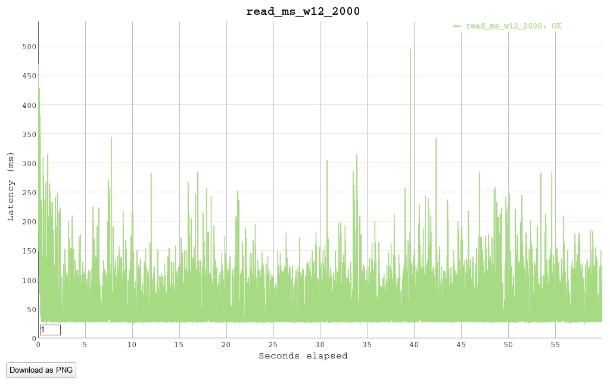
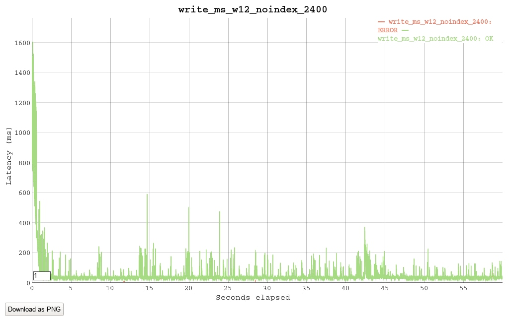

### Конфигруация стенда
AWS m5d.4xlarge инстанс (16 виртуальных ядер). 
В [предыдущем тесте](perftest_1.md) сервер показал очень низкий rps при записи в базу с индексами.
m5d.4xlarge имеет более высокий лимит IOPS. Докер был развернут на NVMe-разделе.
Это позволит проверить гипотезу о том, что скорость записи в данном сценарии ограничена скоростью I/O.

### Конфигруация сервера
Тестировалась связка **gunicorn - mysql**.   
- Gunicorn: 12 воркеров aiohttp.GunicornWebWorker. 
- Mysql: 1 мастер + 2 слейва, асинхронная row-based репликация

### База    
Для теста сгенерирована база 8'000'000 случайных аккаунтов, с 4-я индексами аналогично предыдущему тесту. 

Тестрование производилось инструментом [vegeta](https://github.com/tsenart/vegeta). Длительность прогонов - 60 секунд.

### Сценарий 1: Чтение 
/find_users

1.0. rps=1000

2 слейва нагружены, мастер - нет.
Общая нагрузка на Mysql практически аналогична прогону таким же рейтом в предыдущем тесте.

```
Gunicorn cpu: 85
Mysql cpu: 2 * 75
Requests      [total, rate, throughput]  60000, 1000.12, 999.64
Latencies     [mean, 50, 95, 99, max]    34.959178ms, 31.929964ms, 65.304142ms, 111.062206ms, 296.491364ms
Status Codes  [code:count]               0:1  200:59999  
```


---

1.1. rps=2000

В 2 раза большее количество ядер позволяет держать рейт на котором конфигурация из предыдущего теста уже отказывала.

```
Gunicorn cpu: 170
Mysql cpu: 2 * 160
Requests      [total, rate, throughput]  120000, 2000.02, 1998.19
Latencies     [mean, 50, 95, 99, max]    41.920287ms, 32.322097ms, 107.723362ms, 171.257645ms, 495.916105ms
Status Codes  [code:count]               200:120000  
```


---

1.2. rps=3000

Нагрузка растет практически пропорционально.

```
Gunicorn cpu: 260
Mysql cpu: 2 * 250
App cpu: 260
Requests      [total, rate, throughput]  180000, 3000.02, 2988.49
Latencies     [mean, 50, 95, 99, max]    84.825761ms, 40.472011ms, 269.375396ms, 415.754915ms, 866.778679ms
Status Codes  [code:count]               0:10  200:179990  
```


---

1.3. rps=4000

Задержки резко выросли, упираемся в CPU.

```
Gunicorn cpu: 350
Mysql cpu: 2 * 350
Requests      [total, rate, throughput]  240000, 4000.02, 3932.85
Latencies     [mean, 50, 95, 99, max]    311.904977ms, 245.080757ms, 775.200032ms, 1.469709689s, 8.006046123s
Status Codes  [code:count]               0:20  200:239980  
```


---

1.4. Чтение без индексов, rps=5000

Отказ.
```
Requests      [total, rate, throughput]  27360, 4089.83, 3034.27
Latencies     [mean, 50, 95, 99, max]    1.998584599s, 1.730324039s, 4.783516126s, 6.639654787s, 8.137291155s
Status Codes  [code:count]               0:213  200:27147  
```


---

### Сценарий 2: запись 
/update_user

2.1. rps=200

В этом сценарии появляется нагрузка на мастере. Слейвы нагружены чуть слабее (row-based репликация).
В предудышем тесте сервер не держал такой рейт.
```
Gunicorn cpu: 15
Mysql cpu: 28 + 2*18
Requests      [total, rate, throughput]  12000, 200.02, 199.91
Latencies     [mean, 50, 95, 99, max]    36.048313ms, 31.894473ms, 33.639899ms, 215.554222ms, 839.820962ms
Status Codes  [code:count]               200:12000  
```


---

2.2. rps=400

```
Gunicorn cpu: 25
Mysql cpu: 53 + 2*35
Requests      [total, rate, throughput]  24000, 400.02, 399.79
Latencies     [mean, 50, 95, 99, max]    33.295904ms, 31.382473ms, 34.865368ms, 56.846268ms, 537.443302ms
Status Codes  [code:count]               200:24000  
```


---

2.3. rps=800

На таком рейте появляются большие задержки в 99-пертентиле.
```
Gunicorn cpu: 60
Mysql cpu: 125 + 2*75
Requests      [total, rate, throughput]  48000, 800.02, 798.05
Latencies     [mean, 50, 95, 99, max]    56.127842ms, 33.02647ms, 175.889399ms, 329.2687ms, 867.453082ms
Status Codes  [code:count]               0:78  200:47922  
```


---

2.4. rps=1200

Mysql пытается в concurrency,
но здержки 95-перцентиле становятся очень большими.
```
Gunicorn cpu: 80
Mysql cpu: 180 + 2*(50-95)
Requests      [total, rate, throughput]  72000, 1200.02, 1194.24
Latencies     [mean, 50, 95, 99, max]    176.814156ms, 94.802653ms, 605.634207ms, 817.702507ms, 1.195628587s
Status Codes  [code:count]               0:61  200:71939  ```
```


---

2.5. Попробуем запись без индексов, rps=1200

Отсутствие индексов сильно облегчает работу слейвов даже в row-based режиме.
```
Gunicorn cpu: 70
Mysql cpu: 85 + 2*7
Requests      [total, rate, throughput]  72001, 1200.02, 1199.05
Latencies     [mean, 50, 95, 99, max]    32.749164ms, 31.568973ms, 33.818638ms, 64.294995ms, 521.562758ms
Status Codes  [code:count]               0:21  200:71980  
```


---

2.6. Запись без индексов, rps=1600

```
Gunicorn cpu: 95
Mysql cpu: 110 + 2*9
Requests      [total, rate, throughput]  96000, 1600.02, 1598.73
Latencies     [mean, 50, 95, 99, max]    33.323655ms, 31.665504ms, 34.931689ms, 82.895941ms, 610.319563ms
Status Codes  [code:count]               0:28  200:95972  
```


---

2.7. Запись без индексов, rps=2400

Непропорционально рейту растет cpu на мастере после превышения 100%.

```
Gunicorn cpu: 150
Mysql cpu: 340 + 2*13
Requests      [total, rate, throughput]  96000, 1600.02, 1598.73
Latencies     [mean, 50, 95, 99, max]    33.323655ms, 31.665504ms, 34.931689ms, 82.895941ms, 610.319563ms
Status Codes  [code:count]               0:28  200:95972  
```


---

2.8. Запись без индексов, rps=3600

```
Requests      [total, rate, throughput]  216001, 3600.03, 3592.18
Latencies     [mean, 50, 95, 99, max]    66.896613ms, 35.482219ms, 170.454641ms, 604.083648ms, 1.831740116s
Status Codes  [code:count]               0:356  200:215645  
```


---

### Выводы
Балансирование запросов на чтение позволяет скалировать read-нагрузку. 

Оверхед по CPU под read-нагрузкой, относительно конфигурации без слейвов, небольшой.

Для обеспечения выского рейта write-запросов крайне важна скорость дисковой подсистемы.

Индексы сильно аффектят скорость записи.

Индексы сильно аффектят cpu слейвов под write-нагрузкой даже при row-based репликации.
